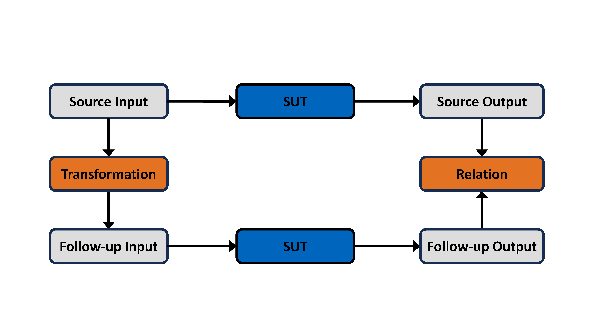
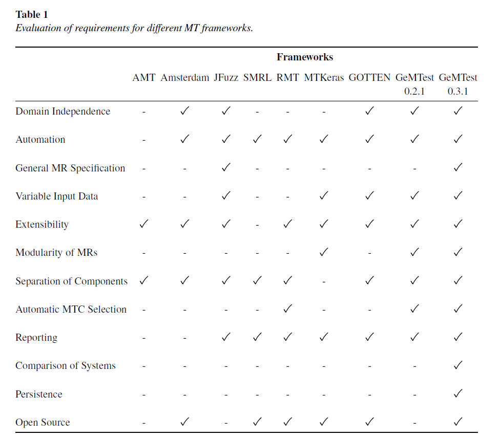
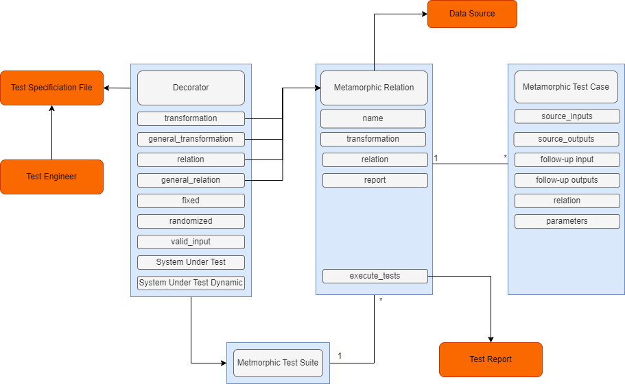
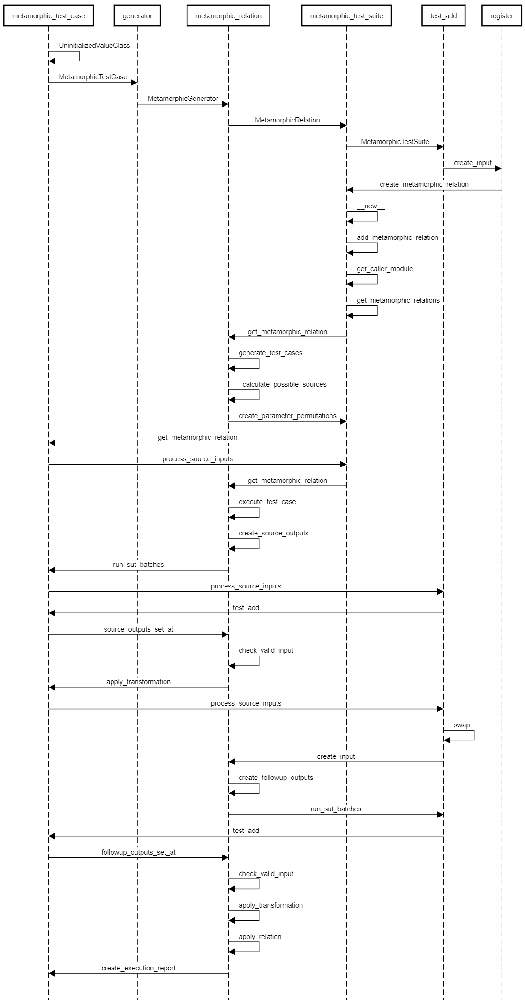

Contributors Overview
=====================

This section will provide a detailed overview of the ``gemtest`` framework for contributors.

Purpose and Use Cases
---------------------

Metamorphic testing is a powerful tool for software testing, mainly when a test oracle is unfeasible or unavailable.
The ``gemtest`` framework enables users to write metamorphic tests for their implementations simply and intuitively!

**Its primary use cases include:** 

    - **Identifying defects in the implementation:** Applying metamorphic testing allows for discovering bugs that could stay unnoticed in traditional testing methods.
    - **Testing the Untestable:** As mentioned above, metamorphic testing is particularly useful for testing programs or algorithms where no test oracle is available, such as machine learning algorithms.
    - **Automatic test case generation:** By applying transformations to source inputs and outputs, we can automatically generate follow-up input and output pairs.

**Metamorphic Testing Overview:**

We transform our source inputs to generate a follow-up input. We apply those two inputs using the system under test results in the source and follow-up outputs.
A relation (for example, equality) is used to compare the two outputs. A test case `fails` when the specified relation does not hold for the source and follow-up outputs.

|

Features and Capabilities
-------------------------

The ``gemtest`` framework offers a range of features and capabilities:

- **Decorators for Function Registration:** Use decorators to register functions such as transformations, relations, and the system under test. This flexibility allows for custom transformations and relations to be applied to various systems under test, including graph problems, image classification tasks, and other machine learning application domains. 
- **Randomized and Fixed Argument Generation:** Generate arguments randomly using the ``@randomized`` decorator or fix arguments using the ``@fixed`` decorator. 
- **Visualization and Reporting:** The ``gemtest`` framework provides various visualizations, including a string report and an HTML report. These reports allow you to see the generated follow-up inputs and outputs. The ``gemtest-webapp`` allows users to view metamorphic test cases in detail and analyze the tests run further.

Comparison to other Frameworks
------------------------------

The table below illustrates the ``gemtest`` framework compared to other metamorphic testing frameworks. It offers a variety of features and advantages.

|

Architecture Overview and Key Components
-----------------------------------------

The ``gemtest`` framework allows users to register functions such as relations, transformations, and systems under test using **Decorators**.
These components are necessary to create the **Metamorphic Test Suite**.

The **Metamorphic Test Suite** is the class that holds all **Metamorphic Relations**. It can add further metamorphic relations to the test suite and also provides fixed and randomized generators.

The **Metamorphic Relation Class** holds a single Metamorphic Relation Object. It also provides the functionality for creating **Metamorphic Test Cases** and executes them by applying the defined transformations and relations.

Lastly, the **Metamorphic Test Case Class** holds a concrete Metamorphic Test Case of a Metamorphic Relation. PyTests are executed on an instance of this class.
A Metamorphic Test Case consists of the source input and outputs, the follow-up input and outputs, as well as parameters, visualizers, the relation result, and more. 

.. note::

    A metamorphic relation must have a name and a data source specified from which metamorphic test cases are created.

|

Further Components
##################

1. **Generators** 
 
 ``gemtest`` provides two **generators** you can use to randomize arguments in the ``@randomize`` decorator. The RandFloat and RandInt classes implement a random float and int generator, respectively.

2. **Relations** 

 Relations like equality, less than, greater than, or approximately equals are already implemented and ready to be used. Using the ``or_`` relation, a user can combine two relations using the logical `or.`

3. **Testing Strategies**
 
 Metamorphic test cases are created depending on the selected testing strategy. The Testing Strategy class provides the **SAMPLE** and the **EXHAUSTIVE** testing strategies. We create either a specified number of test cases using the sample strategy or a test case for every element provided by the data.

.. _test_workflow:

Test Execution Workflow
-----------------------

The following sequence diagram was automatically created using ``plantuml``, after generating a log file containing the framework's function calls. The test run for generating these logs was the simple test_add.py example.

.. note::

    We have modified the data source in this execution to contain only a **single** test case! 

|

The test execution starts with the initialization of various classes. A metamorphic relation containing a name, the source data, and a relation is then registered to the MetamorphicTestSuite class. The diagram shows how we generate test cases, process the inputs, and execute the test cases. We apply the transformation functions and the relations and create an execution report containing all the relevant components of a test case execution.

Workflow for Multiple Tests
###########################

The sequence diagram above showcases only a single metamorphic test case being executed. However, in practice, we usually run hundreds or thousands of test cases. Here is how the workflow for multiple test cases differs:

    - The test file creates inputs for every single metamorphic test case.
    - We generate the metamorphic test cases and process all the inputs.
    - Metamorphic test case execution remains identical to the diagram above. We run tests sequentially, meaning the same execution is repeated many times for the different tests.

Installation
------------
If you want to get started with ``gemtest``, you can follow the :ref:`Development Setup <development_setup>`.

Contributing to Gemtest
-----------------------

If you plan to contribute to the ``gemtest`` framework, please familiarize yourself with our :ref:`Coding Standards <coding_standards>` and :ref:`Contributing on Gitlab Guide <gitlab_contribution>`.

Example Implementations
-------------------------

If you are interested in seeing the ``gemtest`` framework in use, check the :ref:`Example Section <examples>` and the `gemtest-examples repository <https://github.com/tum-i4/gemtest-examples>`_.
