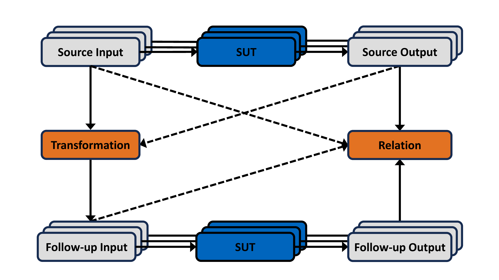

Advanced Usage and Detailed Guide
=================================

This section will enable a user to write advanced tests with ``gemtest``.

Available Relations
-------------------
A relation compares the source output with the follow-up output. It returns a boolean indicating whether the relation holds or is violated. 

1. The **approximately** relation checks if the given arguments are approximately equal with a specified absolute or relative tolerance by delegating to **pytest.approx**. 

.. code-block:: python

    def approximately(f_x: Source_Output, f_xt: Follow_Up_Output,  
                      relative: float = None, absolute: float = None,
                      **_kwargs) -> bool:
        return f_x == pytest.approx(f_xt, rel=relative, abs=absolute)

2. The **is_less_than** relation checks if the source output is strictly smaller than the follow-up output 

.. code-block:: python

    def is_less_than(f_x: Source_Output, f_xt: Follow_Up_Output, **_kwargs) -> bool:
        return f_x < f_xt

3. The **is_greater_than** relation checks if the source output is strictly larger than the follow-up output 

.. code-block:: python

    def is_greater_than(f_x: Source_Output, f_xt: Follow_Up_Output, **_kwargs) -> bool:
        return f_x > f_xt

4. The **equality** relation checks for equality of the source and follow-up output

.. code-block:: python

    def equality(f_x: Source_Output, f_xt: Follow_Up_Output, **_kwargs) -> bool:
        return bool(f_x == f_xt)

5. The **or** relation takes two relations as arguments and returns a relation that checks if at least one of the given relations holds.

.. code-block:: python

    def or_(rel1: Relation, rel2: Relation, **kwargs) -> Relation:
        def or_impl(f_x: Source_Output, f_xt: Follow_Up_Output) -> bool:
            return rel1(f_x, f_xt, **kwargs) or rel2(f_x, f_xt, **kwargs)  

        or_impl.__name__ = f'{rel1.__name__} or {rel2.__name__}'
        return or_impl

Given the **or** relation, it is possible to construct further relations such as less or equal, combining the **equality** and **is_less_than** relations.

.. _decorator_section:

Decorators
----------
Decorators can register our implemented functions as transformations, relations, SUTs, etc. This section will provide an overview of the available decorators and how to use them.

Transformation
++++++++++++++

1. Use ``@transformation`` to register the decorated function as a transformation for a pre-defined metamorphic relation. A transformation takes a single source input and creates a single follow-up input. 
The functions take one or more metamorphic relations as arguments. 

.. note::
    
    Every metamorphic relation can only have one registered **transformation**.

.. code-block:: python 

    @gmt.transformation(<mr1_name, mr2_name, ... >)
    def example_transformation(source_input: int):
        # <Apply custom transformation to source input>
        return followup_input

Properties
##########

.. list-table::
   :widths: 20 80
   :header-rows: 1

   * - Argument
     - Description
   * - <mr1_name, mr2_name, ...>
     - The names of the metamorphic relations to which this transformation is applied.
 
 

General Transformation
++++++++++++++++++++++

2. The ``@general_transformation`` decorator can be used to define a transformation of **multiple** source inputs, creating **multiple** follow-up inputs. There is also the possibility to use
source inputs and source outputs to create follow-up inputs. Registering a general_transfomation to a metamorphic relation works identically to the registration for a transformation.

.. note::
    
    Every metamorphic relation can only have one registered **general_transfomation**.

.. code-block:: python 

    @gmt.general_transformation(<mr1_name, mr2_name, ... >)
    def example_general_transformation(mtc: MetamorphicTestCase) -> *Input:
        # <access single source_input> 
        input = mtc.source_input
        
        # <access multiple source_inputs> 
        input_list = mtc.source_inputs
        
        # <apply custom transformation to Input>
        return followup_input_1, followup_input_2, ... , followup_input_n

The general_transformation is best used for a more general approach. For more information on using the general_transform decorator, visit the :ref:`General Approach <general_approach_section>` section.

Properties
##########

.. list-table::
   :widths: 20 80
   :header-rows: 1

   * - Argument
     - Description
   * - <mr1_name, mr2_name, ...>
     - The names of the metamorphic relations to which this general transformation is applied.

Relation
++++++++

3. Use ``@relation`` to register the decorated function as a relation for a pre-defined metamorphic relation. A relation takes a single source output and a single follow-up output to evaluate if the metamorphic relation holds for a specific metamorphic test case.

.. note::
    
    Every metamorphic relation can only have one **relation**.

.. code-block:: python 

    @gmt.relation(<mr1_name, mr2_name, ... >)
    def example_relation(source_output: Output, followup_output: Output) -> boolean:
        <apply custom relation to Outputs> 

Properties
##########

.. list-table::
   :widths: 20 80
   :header-rows: 1

   * - Argument
     - Description
   * - <mr1_name, mr2_name, ...>
     - The names of the metamorphic relations to which this relation is applied.

General Relation
++++++++++++++++

4. The ``@general_relation`` decorator can be used to evaluate if the specified relation holds for multiple source output and follow-up output pairs. Additionally, a general relation can consider source and follow-up inputs and
outputs when evaluating if the metamorphic relation holds for a metamorphic test case. Registering a general_relation to a metamorphic relation works identically to registering a relation.

.. note::
    
    Every metamorphic relation can only have one **general_relation**.

.. code-block:: python

    @gmt.general_relation(<mr1_name, mr2_name, ... >)
    def general_relation_example(mtc: MetamorphicTestCase) -> boolean:
        <apply custom relation to attributes of MetamorphicTestCase>

Like the general_transfomation, the general_relation can also be used for a general approach. See the :ref:`General Approach <general_approach_section>` section for more information.

Properties
##########

.. list-table::
   :widths: 20 80
   :header-rows: 1

   * - Argument
     - Description
   * - <mr1_name, mr2_name, ...>
     - The names of the metamorphic relations to which this general relation is applied.

System Under Test
+++++++++++++++++

5. A function annotated by ``@system_under_test``, whose name must begin with ``test``, takes a single input and returns a single output. Registering a system under test to a metamorphic relation works identically to the registration for a transformation.

It is possible to define multiple systems under tests in a single file. If you want a more detailed look at how this can be implemented, check this :ref:`example <registering_multiple_suts>`

.. note::
    
    Every metamorphic relation can have multiple registered **systems under test**.

.. code-block:: python

    @gmt.system_under_test(<mr1_name, mr2_name, ... >, batch_size)
    def test_<system_name>(input: Input) -> Output:
        <apply custom system functionality to Input>

When the **batch_size** argument is given to the system_under_test decorator, the SUT function will receive a list of inputs for batch execution. In this case, it should also return a list of the same length containing the corresponding outputs.
To achieve this, the framework creates a dequeue for each SUT containing an entry for every input (both source and follow-up) ready to be executed.
During initial test creation, this is filled with the source inputs of every test case. Once a test case is to be executed, the items assigned to it are removed from the queue first. If there is still space in, the batch is filled with an additional item from the queue.
After the SUT has been executed, each test case is checked to see whether all source outputs have been generated. If so, the outputs are validated, and the follow-up inputs are generated and added to the queue.

Properties
##########

.. list-table::
   :widths: 20 80
   :header-rows: 1

   * - Argument
     - Description
   * - <mr1_name, mr2_name, ...>
     - The names of the metamorphic relations to which this system under test is applied.
   * - batch_size
     - The batch size for batch execution of the system under test. **System under test function will need a list of inputs!**
   * - visualize_input
     - A function to visualize an individual input to the system under test. If you are using the ``gemtest-webapp``, use this parameter if your input data can benefit from visual representation (e.g., images).
   * - visualize_output
     - A function to visualize the output of the system under test. If you are using the ``gemtest-webapp``, use this parameter if your output data can benefit from visual representation (e.g., images).
   * - data_loader
     - Loads an image resource from a file path. The ``gmt.load_image_resource enables`` lazy loading of .png, .jpg, .jpeg and .ppm files. The data loader returns a numpy array of the image.
   * - data_exporter
     - A function that exports data. The data should be stored under assets/data.

Dynamic System Under Test
+++++++++++++++++++++++++

6. The decorator ``@systems_under_test_dynamic`` can be used to load a system under test dynamically. **sut_loader.py** is responsible for loading the actual SUT.
The CLI arguments in the table below have to be set. You can apply the same arguments as in the ``@system_under_test`` decorator.

.. list-table::
   :widths: 20 80
   :header-rows: 1

   * - Argument
     - Description
   * - ``--sut_filepath=<sut_filepath>``
     - The absolute path of the file containing the SUT class.
   * - ``--sut_class=<class_name>``
     - The class name of the SUT inside the file, as defined by ``sut_filepath``. The only limitation is that the SUT class can be instantiated using an empty constructor, e.g., ``SUT()``.

The dynamically loaded SUT is made accessible in the sut_function with the parameter dynamic_sut.
This parameter name cannot be changed.

Example Usage (in this case, batching is also used): 
#####################################################

.. code-block:: python

    # sut_filepath.py:
    class SUT:
        def __init__(self):
            # some initialization
            ...
        
        def execute(images: List[np.ndarray]) -> List[np.ndarray]:
            # do some processing
            your_results = images
            return your_results

.. code-block:: python

    # test_dynamic_sut.py:
    import math
    import gemtest as gmt
    
    mr_1 = gmt.create_metamorphic_relation(name='mr_1',
                                           data=range(100),
                                           testing_strategy=gmt.TestingStrategy.SAMPLE,
                                           relation=gmt.equality,
                                           number_of_sources=1,
                                           number_of_test_cases=10)
    
    @gmt.transformation(mr_1)
    def dummy_transformation(source_input: int):
        return source_input
    
    @gmt.systems_under_test_dynamic(
        data_loader=gmt.load_image_resource,
    )
    def test_dynamic_image_classifier(images: List[np.ndarray], dynamic_sut) -> List[int]:
        # dynamic_sut.execute() is just an example. You have to use your own class methods, of course.
        return dynamic_sut.execute(images)

.. note:: 
    If the CLI arguments are set, functions decorated with **@system_under_test** will be skipped automatically. On the other hand, if the CLI arguments are not set, functions decorated with **@systems_under_test_dynamic** will be skipped automatically.

The ``@systems_under_test_dynamic`` functionality allows you to run your ``gemtest`` test definitions for different/multiple SUTs more easily. If you want to do this, you have to write your own runner script, which executes the command for different SUTs.
This functionality is not available out of the box, as the way in which the SUTs are saved is application-/user-specific.

A possible runner could look similar to something like this:

.. code-block:: python

    sut_class = "SUT"
    sut_classifier_list = custom_sut_file_loader("your/folder/path/")
    command = "poetry run pytest"
    command_split = shlex.split(command)
    command_split.extend(rest_args)
    for sut_path in sut_classifier_list:
        sut_cli_args = [f"--sut_filepath={sut_path}",
                        f"--sut_class={sut_class}"]
        command_split.extend(sut_cli_args)
        cwd = Path(__file__).parent.parent
        
        # your cwd should be the mt-framework root directory
        subprocess.run(command_split, cwd=cwd, check=False)

Valid Input
+++++++++++

7. The ``@valid_input`` decorator registers a decorated function as a metamorphic valid input function for the metamorphic tests listed in names.

.. note:: 
  You can define multiple valid input functions for a single metamorphic relation. These functions are OR'ed together, meaning that if any one of them returns `True`, the input is considered valid. If you need to enforce multiple conditions conjunctivally (i.e., all conditions must be met), you should include all conditions within a single valid input function.
.. code-block:: python

    @gmt.valid_input(<mr1_name, mr2_name, ... >)
    def example_valid_input(input: Input) -> bool:
        <Specify valid inputs>
        return input in valid_inputs

Properties
##########

.. list-table::
   :widths: 20 80
   :header-rows: 1

   * - Argument
     - Description
   * - <mr1_name, mr2_name, ...>
     - The names of the metamorphic relations to which this valid input function is applied.

Randomize
+++++++++

8. Use the ``@randomize`` decorator to randomize the argument ``arg`` by the value generated by the generator by overriding the value of ``arg`` in the given kwargs. For the purpose of metamorphic testing transformations, it is recommended to apply this to all but the first argument.

.. code-block:: python

    @gmt.randomized("arg", <generator>)
    def example_randomized(arg):
        <Specify functionality here>

.. note:: 
  The generated parameter ``arg`` will be written into the ``mtc.parameters`` dictionary. You can later reuse the parameter. An example implementation reusing parameters can be found in the :ref:`Examples Section<reusing_parameters>`.

Properties
##########

.. list-table::
   :widths: 20 80
   :header-rows: 1

   * - Argument
     - Description
   * - arg
     - The name of the argument to be randomized.
   * - generator
     - The generator function to produce random values for the argument.

Fixed
+++++

9. Similarly, the ``@fixed`` decorator can be used to fix the argument ``arg`` to the given value, overriding the value of ``arg`` in the given kwargs.

.. code-block:: python

   @gmt.fixed("arg", <generator>)
    def example_fixed(arg):
        <Specify functionality here>

.. note:: 
  The generated parameter ``arg`` will be written into the ``mtc.parameters`` dictionary. You can later reuse the parameter. An example implementation reusing parameters can be found in the :ref:`Examples Section<reusing_parameters>`.

Properties
##########

.. list-table::
   :widths: 20 80
   :header-rows: 1

   * - Argument
     - Description
   * - arg
     - The name of the argument to be fixed.
   * - generator
     - The generator function to produce fixed values for the argument.

.. _testing_strategies_section:

Testing Strategies
------------------

We can use different testing strategies for the generation of metamorphic test cases. The **TestingStrategy** class provides the following two strategies:  

- The **SAMPLE** strategy creates a specified number of MTCs from the provided data. 

- The **EXHAUSTIVE** strategy creates an MTC for every element of the provided data. 

.. warning:: 
    
    The EXHAUSTIVE strategy should be used cautiously, in combination with multiple source inputs. The number of created MTCs grows exponentially with the number of source inputs \n, because all possible \n-tuples are generated from the provided data.

You can define the **TestingStrategy** when creating a new metamorphic relation and passing either **TestingStrategy.SAMPLE** or **TestingStrategy.EXHAUSTIVE** as arguments in
``create_metamorphic_relation(testing_stragtegy=<Your Strategy>)``.

Metamorphic Relations
---------------------

To use ``gemtest``, you must first define your metamorphic relations using the ``create_metamorphic_relation()`` function. This function takes in various arguments, such as the name of the relation, the data to be transformed, and the number of test cases to generate.

.. code-block:: python

    def create_metamorphic_relation(
            name: str,
            data: Sequence,
            testing_strategy: str = TestingStrategy.EXHAUSTIVE,
            number_of_test_cases: int = 1,
            number_of_sources: int = 1,
            parameters: Optional[Dict] = None,
            system_under_test: Optional[System] = None,
            transform: Optional[Transform] = None,
            general_transform: Optional[GeneralTransform] = None,
            relation: Optional[Relation] = None,
            general_relation: Optional[GeneralRelation] = None,
            valid_input: Optional[Input] = None
    ) -> MR_ID:

Properties
++++++++++

.. list-table::
   :widths: 20 80
   :header-rows: 1

   * - Argument
     - Description
   * - name
     - Name of the metamorphic relation.
   * - data
     - A sequence of input data that is used to generate metamorphic test cases.
   * - testing_strategy
     - A string that specifies the testing strategy to use for generating metamorphic test cases. Can take the values TestingStrategy.SAMPLE or TestingStrategy.EXHAUSTIVE. Default value is TestingStrategy.EXHAUSTIVE.
   * - number_of_test_cases
     - An integer that specifies the number of metamorphic test cases to generate. Default value is 1.
   * - number_of_sources
     - An integer that specifies the number of input sources to use for generating metamorphic test cases. Default value is 1.
   * - parameters
     - A dictionary that contains the parameters and their possible values for the system under test.
   * - system_under_test
     - An optional object of System class that represents the system under test.
   * - transform
     - An optional object of Transform class that represents the transform function to apply to the input data.
   * - general_transform
     - An optional object of GeneralTransform class that represents the general transform function to apply to the input data.
   * - relation
     - An optional object of Relation class that represents the relation function to apply to the input data.
   * - general_relation
     - An optional object of GeneralRelation class that represents the general relation function to apply to the input data.
   * - valid_input
     - A list of functions that are used to validate the output of the generated metamorphic test cases.

Functions for the properties system_under_test, transform, general_transform, relation, general_relation, and valid_input can be added to a metamorphic relation with annotations after it is created, as seen in the example above. The framework also contains pre-defined functions that can be added to a metamorphic relation during creation.

Metamorphic Test Case
---------------------

The metamorphic test case class holds one concrete instance of a test case for a metamorphic relation. The **TestingStrategy** is used to create MTCs from the provided data object. PyTests are executed on instances of a metamorphic test case. If all PyTests for the metamorphic test cases of a metamorphic relation pass, the relation holds for the provided data.

Properties
++++++++++

.. list-table::
   :widths: 20 80
   :header-rows: 1

   * - Argument
     - Description
   * - source_inputs
     - A list of the source inputs for the metamorphic test case.
   * - source_input
     - A convenience property to access the single source input if there is only one.
   * - followup_inputs
     - A list of the follow-up inputs for the metamorphic test case.
   * - followup_input
     - A convenience property to access the single follow-up input if there is only one.
   * - source_outputs
     - A list of the source outputs for the metamorphic test case.
   * - source_output
     - A convenience property to access the single source output if there is only one.
   * - followup_outputs
     - A list of the follow-up outputs for the metamorphic test case.
   * - followup_output
     - A convenience property to access the single follow-up output if there is only one.

.. _general_approach_section:

General Approach
----------------

Next to the simple functionality provided by ``@transformation`` and ``@relation`` functions, the framework supports a general approach to define metamorphic relations.
Let us revisit the simple sine test we have implemented in the `Quick Start Guide <quick_start_guide>`_. Instead, we will use a general approach and make use of the ``@general_transformation`` and ``@general_relation`` function decorators. 

.. code-block:: python

    import gemtest as gmt
    import math

    mr_2 = gmt.create_metamorphic_relation(
      name='mr_2',
      data=range(10),
      testing_strategy=gmt.TestingStrategy.SAMPLE,
      number_of_test_cases=10,
      number_of_sources=2
    )

    @gmt.general_transformation(mr_2)
    def shift(mtc: gmt.MetamorphicTestCase):
      followup_input_1 = mtc.source_inputs[0] + 2 * math.pi
      followup_input_2 = mtc.source_inputs[1] - 2 * math.pi
      return followup_input_1, followup_input_2

    @gmt.general_relation(mr_2)
    def approximately_equals(mtc: gmt.MetamorphicTestCase) -> bool:
      return gmt.approximately(mtc.source_outputs[0], mtc.followup_outputs[0]) and gmt.approximately(mtc.source_outputs[1], mtc.followup_outputs[1])

    @gmt.system_under_test(mr_2)
    def test_dummy_sut(input: float) -> float:
      return math.sin(input)

