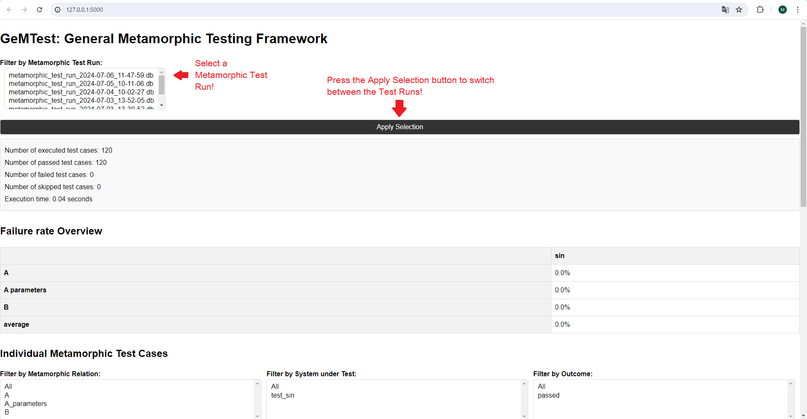
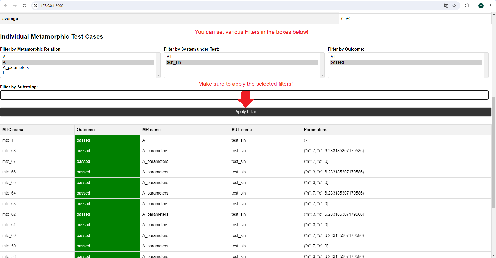
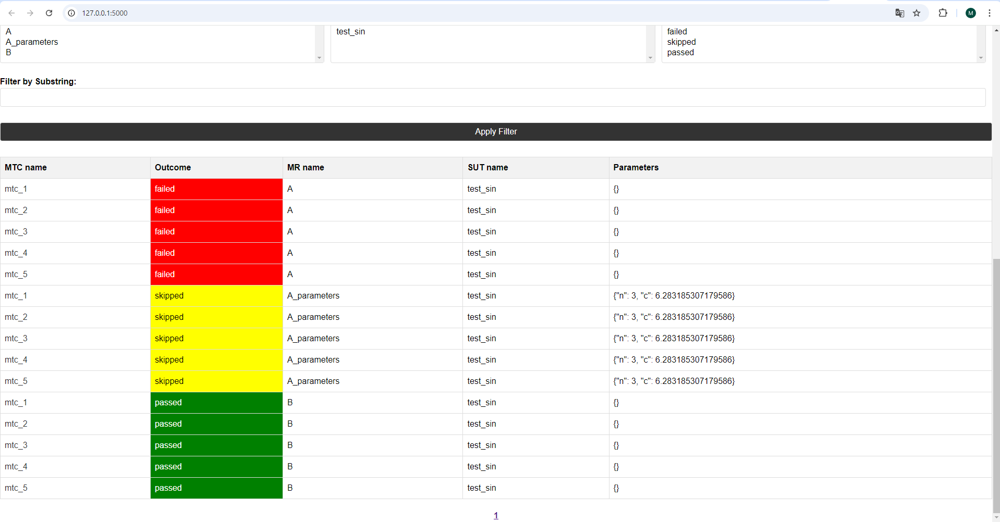
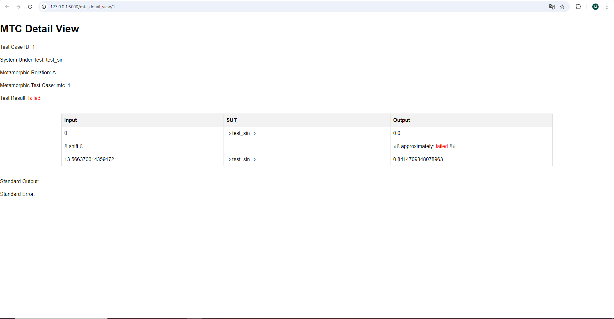

Gemtest-Webapp Guide
====================

This section will guide you through the ``gemtest-webapp`` application that is useful for visualizing your test results.

To install the gemtest-webapp, execute:

.. code-block:: shell

    pip install gemtest-webapp

You can launch the ``gemtest-webapp`` using the following command:

.. code-block:: shell
    
    gemtest-webapp --results-dir gemtest_results/

.. note::

    Before launching the ``gemtest-webapp``, ensure you have already executed tests using the ``--html-report`` flag!
    Look at :ref:`Available options for Testing Metamorphic Relation <available_options_for_testing>` if you are unsure how to run a test.

When you run one or more metamorphic tests, the test runs are displayed in the list at the top. Select the test runs you want to see in more detail here:

   
|

You can apply various filters to the metamorphic test cases as well.

  
|

Failed or skipped test cases can be easily distinguished by their different colors. You can apply filters based on outcomes as well.

  
|

If you want to take a detailed look at individual metamorphic test cases, click on the test name you want to view. This will lead you to a detailed view of that specific test case.

   
|

Here, you can see the transformation applied to the source inputs. You will see the source input and follow-up input combination and the outputs they will create when applied to the system under test. 
Additionally, you can see the specified relation and whether it holds! The detailed test case view helps you quickly spot issues and understand how the system reacts to different inputs.