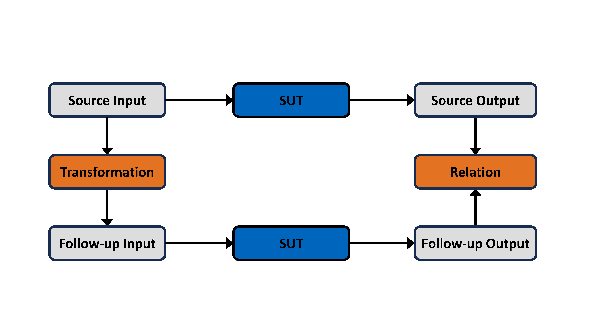

.. _quick_start_guide:

Quick-Start Guide
==================

``gemtest`` is a Python framework for creating and executing metamorphic tests. This guide will walk you through the basics of setting up and using ``gemtest`` with a simple example.

Creating Metamorphic Relations
------------------------------
Every metamorphic relation requires a name and a data source from which the metamorphic test cases are created. You can define a metamorphic relation like this:

.. code-block:: python
   
   mr_1 = gmt.create_metamorphic_relation(name='mr_1', data=range(10))

Defining Transformation Functions
---------------------------------
A function annotated with ``@transformation`` which takes a single source input and creates a single follow-up input. A transformation can be registered to a metamorphic relation by specifying the name of the metamorphic relation in the ``@transformation`` annotation. A transformation is registered to all metamorphic relations of a test file if no metamorphic relation is explicitly specified in the ``@transformation`` annotation.

.. note::

    Every metamorphic relation can only have one registered transformation.

.. code-block:: python

    @gmt.transformation(<mr1_name, mr2_name, ... >)
    def <transformation_function_name>(source_input: Input) -> Input:
        <apply custom transformation to Input>

Implementing Relation Functions
-------------------------------

A function annotated with ``@relation`` which takes a single source output and follow-up output and returns a boolean value. Registering a relation to a metamorphic relation works identically to the registration of a transformation.

.. note::
    
    Every metamorphic relation can only have one registered relation.

.. code-block:: python

    @gmt.relation(<mr1_name, mr2_name, ... >)
    def <relation_function_name>(source_output: Output, followup_output: Output) -> boolean:
        <apply custom relation to Outputs>

Writing System Under Test Functions
-----------------------------------

A function annotated by ``@system_under_test``, whose name must begin with ``test``, takes a single input and returns a single output. Registering a system under test to a metamorphic relation works identical to the registration for a transformation.

.. note::
    
    Every metamorphic relation can have multiple registered systems under test.

.. code-block:: python

    @gmt.system_under_test(<mr1_name, mr2_name, ... >)
    def test_<system_name>(input: Input) -> Output:
        <apply custom system functionality to Input>

.. _simple_example:

Testing the Sine Function with Metamorphic Relations
----------------------------------------------------

This example demonstrates how to use the ``gemtest`` framework to create and test a simple metamorphic relation for the sine function.
It defines a transformation to add 2𝜋 to the input, checks that the sine of the original input is approximately equal to the sine of the transformed input, and verifies this relation automatically for a range of values.

If you want to write more advanced tests, check out the `advanced usage and detailed guide <advanced_usage.html>`_.

.. code-block:: python

    import gemtest as gmt
    import math

    mr_1 = gmt.create_metamorphic_relation(name='mr_1', data=range(10))

    @gmt.transformation(mr_1)
    def example_transformation(source_input: int):
        return source_input + 2 * math.pi

    @gmt.relation(mr_1)
    def example_relation(source_output: float, followup_output: float):
        return source_output == pytest.approx(followup_output)

    @gmt.system_under_test(mr_1)
    def test_example_sut(input: float) -> float:
        return math.sin(input)

We create a metamorphic relation named "mr_1" with its data source. The function ``example_transformation`` allows us to generate follow-up inputs by computing :math:`source\_input + 2\pi`.
Given the properties of the sine function, we utilize the identity :math:`\sin(x) = \sin(x + 2\pi)` to define our relation in the ``example_relation`` function.
To register our function for testing, we use the ``@system_under_test`` decorator on our ``test_example_sut`` function. 

